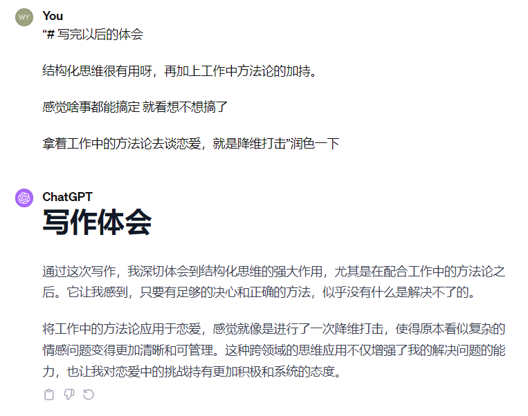

# ---------**恋爱指南---------**

# 目录

```
恋爱指南
├── 前言
├── 心法篇
│   ├── 起步：心态建设
│   ├── 核心：利他性
│   ├── 做到卓越：超预期交付
│   └── 持续进步：复盘与迭代
├── 筛选篇
│   ├── 前言
│   ├── 广泛探索：如何扩大社交圈
│   └── 精心选择：如何设定标准
├── 交往篇
│   ├── 前期侧重
│   │   ├── 吸引力
│   │   └── 互相了解
│   ├── 中期侧重（贯穿始终）
│   │   ├── 情绪价值
│   │   ├── 沟通
│   │   └── 恋爱体验
│   └── 后期侧重
│       ├── 成长与未来
│       └── 信任与安全感、归属感
└── 后记
```


# 前言

本文分为心法篇、筛选篇、交往篇。

这三个部分覆盖了恋爱的准备、选择和实践过程。

里面的东西如果学会了肯定有做渣男/渣女的能力了。但我相信大家都不会选择做渣男/渣女的[doge]。


**心法篇：**

主要讲恋爱前应该具备的心态，以及恋爱中的核心思路。

有了良好的心态导向，你才容易有好的恋爱。

**筛选篇：**

主要讲如何筛选适合自己的对象。

这个很重要，恋爱需要找适合自己的人。

**交往篇：**

有了心法并筛选出了合适的对象，就进入交往阶段了。

主要讲交往时具体要注意的点，在关系的前中后期分别要怎么做，促进关系更好的发展。


内容是基于我个人的经验和理解构建的框架，并通过GPT-4的辅助进行共创。

这种结合人工智能和个人洞察的方式，让文章的内容更加深入和全面，反映了我对恋爱现阶段的全面理解以及方法论。

# 一、心法篇

心法篇主要讲恋爱心态建设和核心思路。

## 1.1起步：心态建设

在恋爱关系中，心态建设是成功的关键。一个健康、积极的心态能够促进个人和关系的成长，减少不必要的冲突和痛苦。以下是恋爱中心态建设的两个重要方面：

#### 1.1.1减少阻力

- **认识和调整防御性心态**: 防御性心态如回避型依恋，可能让人在关系中保持距离，害怕亲密和承诺。识别这些模式，并学习如何逐步克服，比如通过心理咨询、自我反思或正面的社交经验。
- **以提供价值为导向**: 改变心态，从"我能得到什么"转变为"我能提供什么"。当你专注于为对方提供价值时，不仅能减少防御心理，还能增强自己在关系中的积极性和被接纳感。
- **建立勇气和开放性**: 通过正面的互动和经验，逐渐建立在关系中表达自己和敞开心扉的勇气。勇于面对和解决问题，而不是回避或抵制。

#### 1.1.2提升动力

- **内在的追求**: 确认自己对亲密关系的内在需求，如爱、归属感、理解和接纳。这种内在的需求可以成为追求良好感情的强大动力。
- **设定关系目标**: 对于想要达成的关系质量和深度有一个清晰的目标。这些目标可以是共同成长、建立深厚的理解和信任、共同克服挑战等。
- **积极的情感投资**: 投入情感和时间，积极参与关系的建设。这包括共享经历、表达爱意和关心，以及不断地学习和适应以满足双方的需求和期望。

在恋爱中进行心态建设，需要时间和努力。通过减少内心的阻力和提升追求良好感情的动力，可以更好地建立和维护满意和健康的关系。同时，心态的正面转变也有助于个人的情感成长和心理健康，促进了更加深入和稳固的亲密关系。


## 1.2核心：利他性

#### 1.2.1利他性是重中之重

利他性是重中之重，要为对方提供价值。


#### 1.2.2利他性的体现

在恋爱关系中，利他性是一种重要的品质，指的是在关心自己的同时，也无私地关心和为伴侣提供价值。这种关系中的利他性不仅增强了双方的联结，也促进了长期的幸福和满足感。以下是利他性在恋爱中的几种体现：

##### 优先考虑伴侣的需要和幸福

- **理解和行动**: 真正理解伴侣的需求和愿望，并在可能的情况下，将这些需求置于自己的需求之前。
- **支持伴侣的梦想**: 积极支持对方的个人目标和梦想，提供必要的帮助或鼓励。

##### 无条件的爱和支持

- **情感支持**: 在对方需要时提供安慰和鼓励，无论是在成功还是失败时都站在他们身边。
- **无条件的接纳**: 接受对方的所有面貌，包括优点和缺点，**而不是试图改变对方**。

##### 共享和牺牲

- **共享资源**: 无私地共享时间、精力、甚至物质资源，为了对方或关系的整体福祉。
- **适时的牺牲**: 在需要时愿意作出小的或大的牺牲，比如调整个人习惯、时间安排或目标，以适应关系的需要。

##### 促进对方的成长和幸福

- **激励对方**: 通过正面的鼓励和反馈，帮助对方成为更好的人。
- **健康的挑战**: 适当地挑战对方，鼓励他们走出舒适区，同时提供必要的支持。

##### 持续的关怀和体贴

- **日常关怀**: 在日常生活中通过小行动不断展示关怀和体贴，如准备对方喜欢的食物，或者关注对方的健康和情绪。
- **深入了解**: 深入了解对方的内心世界，包括他们的想法、情感和反应，从而更好地满足他们的情感和物质需求。

在恋爱关系中，利他性不仅仅是偶尔的大动作，而是一种持续的、日常的态度和行为，它体现在关系中的每一个小细节中。通过持续地展现利他性，可以建立一个更加稳固和和谐的关系，增加双方的满意度和幸福感。


## 1.3做到卓越：超预期交付

要做到卓越，就要把自己当做产品，把对象当做客户。

然后在接触交往的阶段，做到超预期交付。

对方为什么一定要选你这个产品？因为你能超预期地满足对方需求。


#### 1.3.1预期管理

##### 前提：清晰的沟通和共同的目标

- **沟通期望**: 定期与伴侣讨论各自的期望、愿望和关心的问题，确保两人对关系的目标和方向有共同的理解。
- **适应性调整**: 随着关系的发展和个人的成长，预期可能会变化。要保持适应性，愿意根据新情况调整共同的预期。


##### 策略：关于未来的预期和实际可实现的预期

- **未来的憧憬**:
  - **画饼策略**: 适当地展示对未来的积极憧憬可以是一种激励，比如共同的生活目标、梦想的旅行或成长的可能性。这种正面憧憬有助于保持关系的动力和乐观情绪。
  - **保持现实基础**: 同时，确保这些憧憬有一定的现实基础，避免过度理想化，这样即使梦想中的一些事项未能实现，也不会对关系产生负面影响。
- **实际可实现的预期**:
  - **设定实际目标**: 当涉及到需要实现的具体预期时，如共同的生活安排、财务计划或个人发展目标，重要的是设定实际可达成的目标。过高的预期可能导致失望和不满。
  - **欲扬先抑**: 在某些情况下，适当降低立即的期望，然后超越这些预期，可以产生更大的满足感和惊喜。这种策略要谨慎使用，确保双方仍然对未来持有共同和积极的看法。

在恋爱关系中进行预期管理时，关键在于平衡憧憬和实际，保持沟通和透明度。对未来保持积极憧憬，同时确保对实际可实现的预期保持现实和谨慎。这样既可以保持关系的乐观和向上，也能减少因未达成高期望而带来的不满和失落。通过有效的预期管理，双方可以一起享受过程，同时朝着共同的目标努力。


#### 1.3.2如何做到超预期

##### 一些方式

- **小惊喜**: 不定期地为对方准备小惊喜或者小礼物，如意想不到的约会、特别的纪念品或者简单的爱的笔记。
- **深入了解**: 深入了解对方的喜好、梦想、以及他们的关心点，然后在日常生活中展示你对这些细节的关注和记忆。
- **质量时间**: 确保共同度过的时间是高质量的，专注于对方，做一些有意义的活动，比如一起学习新技能或共同完成一个项目。
- **情感支持**: 在对方需要时提供超出寻常的情感支持，无论是成功的时刻还是挑战的时刻，都要成为他们可靠的伙伴。

在恋爱关系中，超预期交付意味着不断寻求超越对方的期望，通过创意、细心和深情来加深彼此的联系。这不仅能够增强关系的满意度和幸福感，也能够使双方都感受到被珍惜和重视。通过不断的努力和关注，可以在恋爱关系中创造出卓越和超预期的美好时刻。


##### 学习优秀案例并进行拆解对标

- **学习优秀案例**:
  - **观察和分析**: 找対示范性的情侣或伴侣关系，观察他们是如何管理和维护关系的。注意他们如何处理日常生活中的小事，以及在特殊场合如何彼此表达爱意和支持。
  - **提取关键元素**: 从这些优秀案例中提取关键元素，比如他们如何在特殊日子给予惊喜，或者在日常生活中如何维持关心和关注。
- **进行拆解和对标**:
  - **拆解策略**: 将观察到的行为和策略拆解成可操作的步骤。例如，如果一个案例中的一方定期为另一方准备惊喜晚餐，拆解成选择日期、了解对方喜欢的菜肴、准备环境等步骤。
  - **对标实践**: 将自己的行为和这些优秀案例进行对比，看在哪些方面可以改进或创新。对标不是单纯的模仿，而是要结合自己和伴侣的特点，创造适合两人的超预期行为。

做到超预期不仅是偶尔的大动作，更多是在日常细节中的持续努力和创新。通过学习优秀案例，拆解并对标这些行为，你可以在恋爱关系中创造出让对方感到惊喜和特别的时刻。关键在于持续的关注和个性化的行动，了解对方的需求和期待，并在此基础上寻找超越的空间。通过这样的方式，你不仅能够提升对方的满意度和幸福感，也能不断地增强彼此之间的联系和深度。


## 1.4持续进步：复盘与迭代

在恋爱中，复盘与迭代是持续进步和提升关系质量的有效策略。通过对过去的经历进行反思，找出改进的方向，并采取具体的行动来改善，个人和关系都能从中受益。以下是如何从恋爱角度进行复盘和迭代：

#### 1.4.1复盘

##### 从过往恋爱失败的经验中学习:

- **识别不足**: 回顾过往的恋爱关系，特别是那些不成功的经历，试图理解造成失败的原因。可能是沟通不足、情绪管理、信任问题等。
- **情感诚实**: 对自己的行为和思维模式进行诚实的反思，识别那些可能导致关系问题的个人行为或习惯。

##### 根据打分评估自己:

- **设立评分标准**: 对各个方面的恋爱能力进行打分，如沟通、理解力、支持性、共情能力等。参照一定的标准，如你在这些领域中的表现相比于大多数人如何。
  - 具体到这篇文章，按照以下方面：吸引力、互相了解、情绪价值、沟通、恋爱体验、成长与未来、信任与安全感归属感打分。对于每一个方面，如果在人群中做到前10%就是满分，10%-20%就是90分，以此类推，0%-10%就是10分。
- **识别短板**: 找出分数相对较低的领域，这些就是你的短板，需要优先改进。它们可能是技能上的不足，也可能是心态或行为上的问题。

#### 1.4.2迭代

##### 针对性补齐短板:

- **制定改进计划**: 针对每个短板制定具体的改进策略。例如，如果沟通是短板，可以通过阅读相关书籍、参加沟通技巧工作坊或练习日常中的沟通来提升。
- **实践并获取反馈**: 在实际恋爱中应用这些改进措施，并从伴侣或信任的朋友那里获取反馈。

##### 定期复盘和迭代:

- **定期检查**: 设定一段时间后再次进行复盘，评估改进的效果，并根据最新的情况更新你的改进计划。
- **持续迭代**: 恋爱关系是不断变化的，你的需求、伴侣的需求以及关系的环境都可能发生变化。保持灵活性和开放性，根据这些变化调整你的策略和行为。

通过这样的复盘和迭代过程，你可以持续地提升自己在恋爱中的各项能力，更好地理解和适应伴侣的需求，从而建立和维护一个更加健康和满意的关系。这个过程需要自省、勇气和行动，但它对于个人的成长和恋爱关系的质量都有着深远的正面影响。


# 二、筛选篇

在筛选篇中，我们将整个寻找伴侣的过程分为两个环节：接触与筛选。

- **接触环节：广泛探索**。在这一阶段，你应该尽可能地拓宽视野，接触各式各样的人。广泛地接触，以增加遇见合适人选的概率。
- **筛选环节：精心选择**。接下来的筛选环节，则是从之前接触的众多人选中精心挑选出与你最为契合的人。这需要你有明确的标准和认识，仔细地从广泛的选项中选择最适合你的人。

通过确保有足够的基数来接触，加上明确且贴切的选择标准，你就能够更有可能找到那些真正适合你的对象。这个过程既是广度的拓展，也是深度的挖掘，最终引领你走向理想的伴侣。


## 2.1前言

### 2.1.1重要性

筛选是很重要的一环，筛选好了对象，你会事半功倍。否则容易费力不讨好。

##### 叔叔语录

叔叔：我喜欢一个杯子，然后去看了100个。看到一个杯子比之前我喜欢的那个便宜很多，而且和原来那个一毛一样。

##### 要匹配，不要费力不讨好

如果你进错了公司，找了一个和你业务方向不匹配的公司，那对你职业发展就没有积累。

如果你找了一个对象，这个对象的需求与你自身能提供的价值不匹配，也是费力不讨好。

##### 苟阿姨案例建议

苟阿姨的一个粉丝：88年男，上海7套老破小房，体制内税后到手1.5w，收租3w一个月，但生活朴素，看起来普普通通没有有钱人的样子，想找很好看的妹子，很久都找不到，相亲机构介绍的都是拜金女，见面吃饭从不付钱，还老想要他买包包。

苟阿姨建议他：去找一个偏远地区，例如广西、西北、东北地区的漂亮女孩。

这种地方的女孩家乡例如东北人均收入每月3-4k，会被这种男生上海的高收入折服。

如果女孩来上海久了，被大佬看上过，阈值高了，就不行了。


### 2.1.2接触并筛选建议

找到合适的伴侣是一项既重要又个性化的任务，以下是一些普遍适用的建议，帮助你接触并筛选适合你的女生：

1. **了解自己：**首先明确你的价值观、兴趣爱好、生活方式和伴侣期望。这有助于你识别和吸引与你有共同点的人。
2. **扩大社交圈：**通过参加社交活动、兴趣小组或在线交友平台，你可以遇到更多人。选择与你的兴趣和价值观相符的环境，这样更有可能遇到合适的人。
3. **真诚交流：**与人交往时，保持真诚和开放。真诚地了解对方，同时也分享你的想法和感受，这有助于建立深层次的联系。
4. **观察与反思：**在交往的过程中，观察对方的行为和反应，了解她的价值观和性格是否与你相符。同时，**也要反思自己的感受，确定这段关系是否让你感到满意和舒适**。
5. **设定标准：**明确你对伴侣的期望和底线。这不仅关乎外在条件，更重要的是对方的性格、价值观和生活方式。
6. **耐心和开放：**好的关系需要时间建立。保持耐心，**对遇到的人保持开放态度**，同时也要**识别并避免那些不健康或不适合你的关系**。

记住，每个人的交往方式和期望都是独特的，最重要的是找到适合你自己的方式。在整个过程中，保持自我改善和积极态度，最终你会找到适合你的人。


## 2.2广泛探索：如何扩大社交圈

扩大社交圈是一个涉及积极参与和策略规划的过程。以下是一些方法来帮助你拓宽你的社交网络：

### **参与社交活动**

- **社交活动与团体:** 加入兴趣小组或社团，如摄影俱乐部、书籍讨论组、运动队伍等。这可以帮你遇见有共同兴趣的人。
- **参加工作坊与研讨会:** 这些活动常常吸引思想相近的人，提供了自然的交流机会。
- **出席社区活动:** 社区聚会、节日庆典或慈善活动都是与人交流的好机会。

### **网络平台**

- **社交媒体:** 加入相关兴趣的社交媒体群组，积极参与讨论和线上活动。
- **交友应用和网站:** 有许多平台可以帮你找到附近的活动或有共同兴趣的人。

### **提升社交技能**

- **主动出击:** 在活动中**主动与人打招呼，表现出友好和开放的态度**。
- **倾听:** 有效的沟通不仅是讲，更重要的是听。**显示出对对话伙伴的兴趣和尊重**。

### **培养新兴趣**

- **学习新技能:** 参加课程或工作坊学习新技能，如烹饪、舞蹈或编程。这不仅能让你获得新知识，还能遇到不同领域的人。
- **旅行:** 旅行可以让你接触到不同的文化和新朋友。

### **建立深层次联系**

- **跟进:** **与人初次交流后，记得跟进，可以通过发送感谢邮件或在社交媒体上联系**。
- **组织活动:** 自己组织小型聚会或活动，邀请你认识的人和他们的朋友参加。

### **保持积极态度**

- **积极参与:** **在任何社交场合中，保持积极的态度和开放的心态**。
- **处理拒绝:** 不是每个人都会成为你的朋友。学会接受拒绝，并从中学习，继续前进。

通过结合这些策略，你可以有效地扩大你的社交圈，遇到新朋友，并建立有意义的关系。记住，**社交是一个逐步的过程，需要时间和耐心，但通过持续的努力和正面的态度，你会逐渐构建起丰富的社交网络**。


## 2.3精心选择：如何设定标准

在设定寻找伴侣的标准时，重要的是要均衡实际需求和个人愿望，确保这些标准反映了你的价值观、生活方式以及对关系的长期展望。以下是一些步骤和建议，帮助你设定寻找伴侣的标准：

### **了解自己**

- **个人价值观:** 明确你的核心价值观是什么，如诚实、忠诚、尊重或成长。
- **生活目标:** 考虑你的**长期目标，包括职业、家庭、生活方式以及如何与伴侣共享这些目标**。

### **明确非协商条件**

- **底线:** 确定你在关系中**不可妥协的因素，比如忠诚、信仰或生活习惯**等。

- **健康关系的特征:** 考虑哪些关系特质对你来说至关重要，如沟通、尊重和支持。

### **考虑理想特质但保持开放**

- **理想特质:** 确定你希望伴侣拥有的性格特质，如幽默感、智慧或冒险精神。

- **外在条件:** 考虑外在条件如何影响你的选择，但不要让它们完全主导你的决策。

### **实用性和长期目标**

- **兼容性:** 考虑你们在**价值观、兴趣和生活目标上的兼容性**。
- **长期视角:** 想象未来的生活，确定哪些特质会支持持久稳定的关系。

### **从过去学习**

- **过往经验:** 回顾过去的关系，了解**哪些特质或行为促成了关系的成功或失败**。

- **持续学习:** 认识到**人是会变化的，包括你自己和你的伴侣，适时调整你的标准**。

### **保持灵活性和现实性**

- **灵活性:** 人无完人，**保持对理想标准的灵活性，重视整体兼容性而非单一特质**。
- **现实性:** 确保你的标准是**基于现实和个人情况**的，**而非不切实际的理想**。

### **寻求反馈**

- **与亲友讨论:** **他们可能提供不同视角，帮助你更全面地考虑**。
- **专业意见:** 必要时，可以考虑寻求咨询师或心理学专家的建议。

通过这些步骤，你可以建立一套**均衡、个性化且灵活的标准**，帮助你在寻找伴侣的过程中做出更明智的选择。记住，**设定标准是为了指导你找到合适的伴侣，而不是设定一道难以逾越的壁垒**。**保持开放和适应性**，随着你的成长和经验积累，这些标准也许会随之调整。


# 三、交往篇

## ---------前期侧重---------

## 3.1吸引力

### 外在吸引力

外在吸引力涉及个体的外表和身体语言：

- **打理外观**: 注重个人卫生和整洁，选择适合自己的服装风格。外在的打理不仅关乎美观，也是自我尊重和对关系的尊重体现。
- **身体语言**: 通过开放和积极的身体语言表达自信和友好。包括眼神交流、微笑以及开放的姿态等，这些非言语的沟通方式极大地影响着个人的吸引力。

### 内在吸引力

内在吸引力关注个人的性格、智慧和情感：

- **性格魅力**: 发展积极、乐观的生活态度，展现出同理心、幽默感和诚实。一个有趣、多元且真诚的性格，能深深吸引人。
- **智慧和情感**: 拥有广泛的兴趣和知识，愿意学习和成长。同时，能有效地表达和管理自己的情感，显示出情绪智力。

### 社交能力

社交能力是在各种社交场合中交流和建立联系的能力：

- **交际技巧**: 发展良好的交际技巧，包括倾听、表达、适应不同社交场合的能力。这涉及到能在不同人群中自如交流，以及能建立和维护人际关系。
- **网络建设**: 建立和维护广泛的社交网络，这不仅提供了社交的机会，也是个人吸引力的体现。能在多样的群体中建立联系，显示出社交的灵活性和广度。

通过提升外在吸引力、内在吸引力和社交能力，个体不仅在恋爱关系中更加吸引人，也能在日常生活中建立更积极、更广泛的人际关系。这些方面的提升有助于提高个人的整体魅力，促进个人的社交和情感生活。


## 3.2互相了解

一个好用的方法：真心话大冒险，可以微信掷骰子玩，也可以线下玩。

### 共同兴趣爱好

共同的兴趣和爱好可以增强彼此的联系：

- **发掘共同兴趣**: 通过探索和尝试，发现并参与双方都感兴趣的活动。这可以是体育、艺术、音乐、阅读等任何领域。
- **定期共享活动**: 安排定期进行共同爱好的时间，无论是周末徒步、烹饪还是任何其他共同享受的活动。这些共同经历促进了情感的交流和记忆的积累。

### 过往经历和家庭

了解对方的过往和家庭背景对深化理解至关重要：

- **分享个人历史**: 坦诚分享各自的成长经历、过去的重大事件和家庭故事。这有助于理解对方的个性形成和行为动机。
- **家庭交流**: 如果可能，参与对方的家庭活动或节日，了解对方的家庭成员和背景。这不仅可以加深双方的关系，也能增强对对方文化和家庭价值的理解。

通过共同兴趣爱好的参与、文化和智慧的分享，以及了解对方的过往经历和家庭，可以大大增强双方的理解和联结。这些互动和分享是构建深厚关系的重要部分，有助于建立更加坚固和深入的联系。

### 文化和智慧分享

通过分享各自的文化背景和智慧，可以增加理解和尊重：

- **文化交流**: 分享各自的文化习俗、语言和传统，包括节日庆祝方式、食物偏好或家庭习俗等。
- **知识和智慧**: 互相教授或分享个人的专长和知识，比如艺术欣赏、科学知识或生活智慧等。这种知识的交流不仅增加了共同话题，也增强了相互之间的尊重和欣赏。


## ---中期侧重（贯穿始终）---

## 3.3情绪价值

### 高情商聊天

良好的情商可以增强交流的质量和深度：

- **倾听和反馈**: 在聊天中展现出真正的倾听，通过肢体语言和口头反馈显示理解和关注。这不仅是关于言语的交流，更是情感的共鸣。
- **情绪感知**: 提高对自己和对方情绪的感知能力，适时表达关心和提供支持。在对方沮丧、高兴或紧张时给予恰当的反应和关注。

一个好用的方法：问答赞。问对方问题，对方回答，然后你关注对方好的方面并且由衷赞美。可以快速提升对方好感度，快速破冰。

### 足够的陪伴

适当的陪伴是情感联结和支持的基础：

- **质量时间**: 确保共同度过的时间是有质量的，专注于彼此而非分心于其他事物。无论是共进晚餐还是一起散步，都要全情投入。
- **在乎表现**: 表现出在乎对方的日常生活，包括工作、兴趣和小事。通过细节表现出关心，如询问对方的日子或共同解决问题。

### 情绪承托

在关系中提供情绪承托，为对方提供一个安全的情感出口：

- **情感支持**: 在对方需要时提供情感支持，无论是高兴还是悲伤的时刻。这包括安慰、鼓励或仅仅是存在作为支持。
- **情绪稳定**: 作为情绪稳定的源泉，提供一个稳定可靠的环境，让对方在面对外部压力或挑战时，能够感受到安全和被理解。

通过高情商的聊天、确保足够的陪伴以及提供情绪承托，可以显著提升关系中的情绪价值。这些行为和态度有助于建立一个温馨、支持和理解的关系环境，使得双方都能在其中找到情感上的满足和安全感。


## 3.4沟通

### 沟通坦诚清晰

沟通的坦诚与清晰是关系中不可或缺的：

- **坦诚表达**: 鼓励在关系中表达真实的想法和感受，包括愿望、担忧、喜悦和失望。这要求双方保持开放态度，愿意分享也愿意倾听。
- **清晰交流**: 确保交流清晰无歧义，使用直接但体贴的语言表达自己的需要和界限。避免含糊其辞或假设对方能读懂心思，确保双方都能理解并被理解。
- 用"I"语句表达自己，确保信息的清晰传达，避免误解。
  - "I"语句是一种沟通方式，它以自己的感受和想法为出发点，而不是指责或假设对方的意图。例如，说“我感到担忧，当我们晚上不说晚安时”而不是“你让我烦恼，因为你晚上不说晚安。”使用"I"语句可以减少对话中的防御性，促进更开放和诚实的交流。

### 解决冲突的能力

解决冲突的能力是维护关系健康和长久的关键：

- **识别和管理冲突**: 学会识别冲突的早期迹象，并采取积极措施来应对。这包括冷静讨论问题、理解对方观点和情绪，以及寻求共同的解决方案。
- **建设性的对话**: 在冲突中维持建设性和尊重的对话，避免责怪、辱骂或消极的沟通方式。学会使用“I”语句表达自己的感受和需求，同时对对方的需求保持敏感和开放。

在任何关系中，沟通都是连结彼此的桥梁。通过坦诚清晰的沟通建立理解和信任，以及通过有效的冲突解决能力保持关系的和谐与成长，是构建持久和满意关系的重要部分。通过这些沟通技巧的提升，关系中的每一方都能感到更被理解、支持和珍惜。


## 3.5恋爱体验

### 礼物与仪式感

礼物和仪式感在恋爱中扮演特殊的角色，增强情感联结：

- **意义的礼物**: 选择有意义的礼物，不仅仅是价值而是关注对方的喜好、历史和个人故事。它们可以是庆祝里程碑的纪念品，或者只是平日的小惊喜。
- **创造仪式感**: 在特殊的日子或日常生活中创造仪式感，比如纪念日庆祝、每周的约会夜或其他小传统。这些仪式增强共同经历的价值感和期待感。

### 个性化体验

个性化体验强调独一无二的互动和关注细节：

- **定制的惊喜**: 了解和记住对方的偏好，创造定制的体验，如特别的约会场地、定制的礼物或个性化的活动。
- **细节关注**: 在日常生活中展示对对方独特需求和愿望的关注，无论是特别准备的晚餐、一段手写笔记，还是对个人兴趣的共鸣。

### 冒险和新体验

共同探索新事物可以为关系带来新鲜感和成长：

- **共同的冒险**: 规划和经历冒险活动，比如旅行、户外探险或尝试新的娱乐活动。这些经历不仅带来乐趣，也加深了相互间的了解和联系。
- **探索新兴趣**: 鼓励对方（和自己）探索新兴趣和爱好。共同学习新技能或参与对方的兴趣，作为共同成长和探索的一部分。

在恋爱体验中，注重礼物与仪式感、个性化体验和共同冒险，可以显著提升两人之间的情感质量和满足感。通过这些细致和深思熟虑的行为，恋爱关系能够维持新鲜感，同时促进深层次的个人和共同成长。


## ---------后期侧重---------

## 3.6成长与未来

### 成长支持

在关系中，成长支持是关键，它包括:

- **情感支持**: 鼓励对方在个人和职业生活中追求成长，通过倾听、共情和积极反馈提供心理安慰和鼓励。
- **资源共享**: 提供必要的资源，如时间、知识、财务或网络，帮助对方达成个人发展目标。
- **共同学习**: 鼓励一起学习新技能或兴趣，增强关系的同时促进个人成长。

### 共同目标

共同目标是未来规划的核心，涉及:

- **制定计划**: 与对方讨论并设定长期和短期的共同目标，如职业发展、家庭建设或其他个人目标。
- **协作执行**: 共同努力，协调行动，定期检查目标进展，并在必要时调整策略。
- **庆祝成就**: 一起庆祝达成目标的里程碑，增强关系并激励未来的努力。

### 健康和生活习惯

健康的生活习惯对长期的关系和个人福祉至关重要:

- **健康促进**: 在饮食、运动和休息方面相互支持，共同制定健康目标，并鼓励健康的生活方式。
- **习惯建立**: 一起形成和维护有益的日常习惯，如规律的锻炼、健康饮食和足够休息，以及共同应对压力和挑战。
- **心理健康**: 重视双方的心理健康，提供一个安全的环境，讨论和处理压力、焦虑或其他情绪问题，必要时寻求专业帮助。

在关系中，提供成长支持、设定共同目标和促进健康生活习惯是相互依存且互相加强的。这些元素共同作用，帮助双方不仅在个人层面上成长，也在关系中建立更深的连接和更明确的未来方向。


## 3.7信任与安全感、归属感

### 信任与尊重

在任何关系中，信任与尊重是基石：

- **建立信任**: 通过一致性、透明沟通和诚实的行为建立信任。这包括遵守承诺、公开讨论问题和分享感受。
- **相互尊重**: 理解并尊重对方的个人界限、选择和隐私。这意味着认可对方的独立性，避免无理的控制或猜疑，同时欣赏对方的独特价值。

### 安全感

安全感是关系的保障，涉及情感和心理的安全：

- **情感安全**: 创建一个安全的空间，使双方都能表达真实的自我，分享弱点和恐惧而不担心被评判或拒绝。
- **心理安全**: 确保双方都感到被理解、被支持，即使在冲突中也能感到安全和尊重。这包括有效的沟通技巧和冲突解决机制。

### 归属感

归属感是关系中的温暖，是深层次的连接和接纳：

- **接纳和重视**: 确保双方都感到自己是对方生活中不可或缺的一部分。表现为共同的经历、共享的记忆和深层的理解。
- **共享生活**: 通过共同的目标、兴趣和活动增强归属感。这包括支持对方的梦想、一起庆祝成就和共同面对挑战。


# 后记

## 文章给出全面的进步方向

写这个文章整理了一下思路，相当于是一个导向，这样走的时候就能朝着目标走，而不会走歪了。


## 恋爱和个人生活的平衡

现实中资源是有限的，一个人的时间精力除了谈恋爱以外，还有工作，生活，家人和其他的方方面面。精力的分配是有限的。你即便知道你也不会有那么多完整的精力去做到这些。

**GPT4的建议：**

当我们讨论恋爱和个人生活的平衡时，理解现实中资源有限是至关重要的。这不仅仅是关于时间管理，更是关于精力、情感和承诺的平衡。包括：

1. **精力与时间的权衡**:
   - **每个人每天只有24小时，而精力和注意力更是有限的资源**。工作、家庭、个人兴趣和社交活动都需要时间和精力。认识到这一点，**恋爱中的每个人都需要学会优先排序和设定界限，以保证不会在某一方面过度耗费自己**。
2. **情感承载力的边界**:
   - 情感承载力指的是个体处理和应对情感事务的能力。不同人的情感承载力有限且不同，**了解自己的情感界限，合理分配在恋爱、家庭和工作等方面的情感投入，可以避免过度疲惫和情感枯竭**。
3. **质量而非数量**:
   - 在恋爱关系中，**追求时间和活动的质量比数量更为重要**。**短暂但深入和有质量的交流往往比长时间的无目的相处更能增进关系**。重视彼此共度的时光质量，能更有效利用有限的时间和精力。
4. **自我照顾的重要性**:
   - 在追求和维护恋爱关系的同时，个人的自我照顾不可忽视。**保持健康的生活方式、充足的休息、个人兴趣和社交活动，不仅能提高个人幸福感，还能使得恋爱关系更加健康和满足**。
5. **沟通和协商**:
   - 在关系中，开放和诚实地沟通自己的时间和精力限制，以及协商双方的期望和需求，是维持健康关系的关键。这可以包括讨论工作时间、个人空间的需要以及如何共同支持对方的其他承诺。

通过这些扩充内容，可以更全面地理解和探讨恋爱中的资源分配问题，以及如何在有限的现实条件下，建立和维持一段健康、满足的关系。


## 感想：跨领域的结构化思维

通过这次写作，我深切体会到结构化思维的强大作用，尤其是在配合工作中的方法论之后。它让我感到，只要有足够的决心和正确的方法，似乎没有什么是解决不了的。

将工作中的方法论应用于恋爱，感觉就像是进行了一次降维打击，使得原本看似复杂的情感问题变得更加清晰和可管理。这种跨领域的思维应用不仅增强了我的解决问题的能力，也让我对恋爱中的挑战持有更加积极和系统的态度。

##### 彩蛋：

